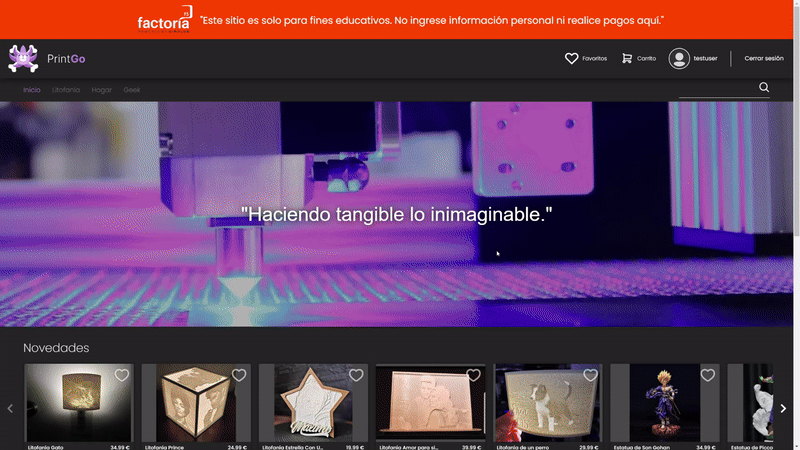
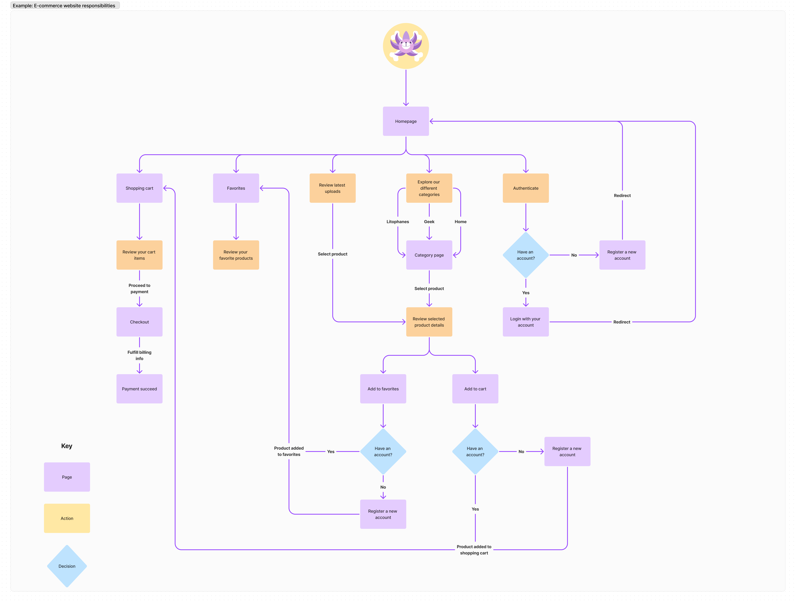
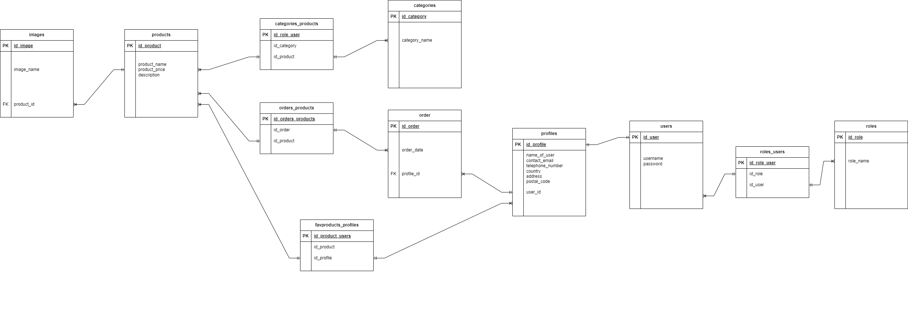

# Print Go!
## ¡Welcome to our 3D printing website, where creativity and innovation come together to give you a unique experience in decoration and gifts!


We are a company specialized in high quality 3D printing, offering a wide range of products in both filament and resin. What makes us stand out? Our versatility and attention to detail. From figures from your favorite series to personalized lithophanes, we are here to transform your ideas into tangible reality.

This project combines a robust backend with a modern frontend to offer a complete and efficient user experience. The combination of technologies and tools used ensures a scalable and easy-to-maintain application.

## Backend Github Link

<https://github.com/FactoriaF5-Asturias/ProjectSomosF5-Backend-Team2-Gijon23_24>

## Production links

Frontend: <https://printgo.factoriaf5asturias.org/> </br>
API: <https://api-printgo.factoriaf5asturias.org/>

## Main features

- Full register and login
- Admin password change
- User profile edit
- New product creation (using Amazon S3 for image storing)
- Product delete (removes images from S3 as well)
- Search products by name (using query and endpoint in backend)
- Favorites (using many to many relationship in backend)
- Stripe payment
- Deployed with AWS

## Screenshots and Recordings


Registering and login process:  </br> </br>


Add to favorites:  </br> </br>


Payment process:  </br> </br>




## Used technology

FRONTEND: <br />
[Vue](https://vuejs.org/)<br />
[Vuetify](https://vuetifyjs.com/)<br />
[Vue-Router](https://router.vuejs.org/)<br />
[Pinia](https://pinia.vuejs.org/)<br />
[Sass](https://sass-lang.com/)<br />
[Vite](https://vitejs.dev/)<br />
[Vitest](https://vitest.dev/)<br />
[Axios](https://axios-http.com/docs/intro)<br />
[Axios-Retry](https://www.npmjs.com/package/axios-retry)<br />
[Stripe](https://docs.stripe.com/get-started)<br />


BACKEND: <br />
[Java](https://www.java.com)<br />
[Spring](https://spring.io/projects/spring-framework)<br />
[Maven](https://maven.apache.org/)<br />
[Lombok](https://projectlombok.org/)<br />
[MySQL](https://www.mysql.com/)<br />
[H2 Database](https://www.h2database.com/html/main.html)<br />
[Hamcrest](https://hamcrest.org/JavaHamcrest/)<br />
[AWS Java SDK](https://mvnrepository.com/artifact/software.amazon.awssdk/s3)<br />

## Userflow



## Tables diagram concept



## AWS Architecture Diagram


## License

This project is licensed under the terms of the MIT License. See the LICENSE file for more details.

## Recommended IDE Setup

[VSCode](https://code.visualstudio.com/) + [Volar](https://marketplace.visualstudio.com/items?itemName=Vue.volar) (and disable Vetur) + [TypeScript Vue Plugin (Volar)](https://marketplace.visualstudio.com/items?itemName=Vue.vscode-typescript-vue-plugin).

## Customize configuration

See [Vite Configuration Reference](https://vitejs.dev/config/).

## Project Setup

```sh
npm install
```

### Compile and Hot-Reload for Development

```sh
npm run dev
```

### Compile and Minify for Production

```sh
npm run build
```

### Run Unit Tests with [Vitest](https://vitest.dev/)

```sh
npm run test:unit
```
